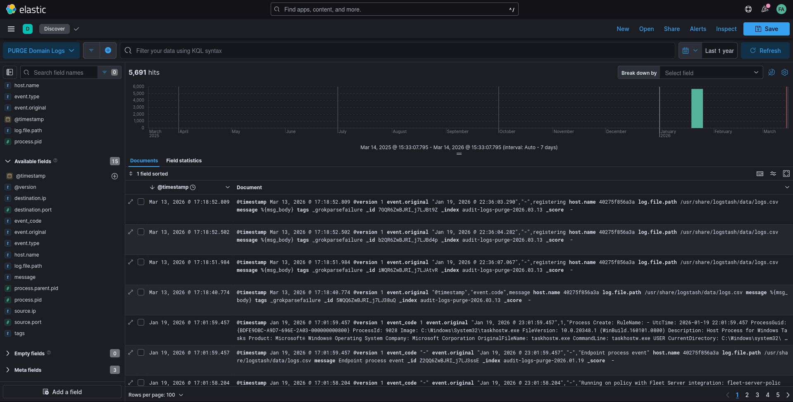
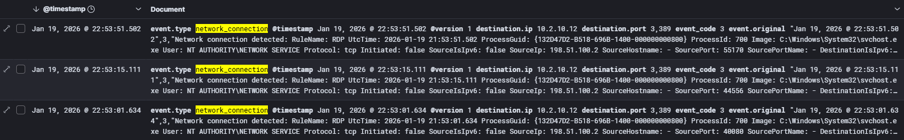
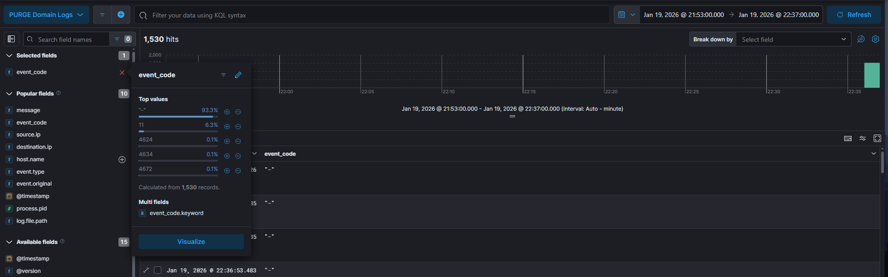

# Midnight Flag 2026 - Forensics - Post-Mortem Artifacts (1/3)

- **Catégorie :** Forensics

- **Description :**  The purge.local domain has been compromised by the Executor. The SOC team needs your help to analyze the logs and reconstruct the attack path. Your Mission: You are the lead forensic analyst. Analyze the provided logs to reconstruct the kill chain. We have spun up a dedicated SIEM instance for your investigation. The recovered logs have been ingested and normalized. Kibana credentials: `analyst:ThePurgeIsComing1337%`

    The first flag is splitted into 5 parts:

    - part 1: CVE used for the initial compromise
    - part 2: Name of the server compromised by this CVE
    - part 3: Username of the user who exploited this CVE
    - part 4: IPv4 address of the Executor
    - part 5: Minutes and seconds of the time where the exploit was triggered (MM:SS)

    Format: `MCTF{part1_part2_part3_part4_part5}` Example: `MCTF{CVE-2017-0144_SERVER-01_admin_192.168.1.10_12:34}`

## Analyse 

### 1. Exploration initiale dans Kibana



Après connexion à l’instance Kibana fournie, plusieurs types de champs sont disponibles : `event.original`, `event.type`. On commence par explorer les événements réseau : `event.type: network_connection`



On observe plusieurs connexions sortantes dans une même fenêtre de temps.

### 2. Identification d’une activité suspecte

Un événement attire l’attention, une tentative de connexion RDP depuis une machine externe.

- IP source : `198.51.100.2`

- Destination : `10.2.10.12`

- Hostname : `PURGE-SRV2.purge.local`

- Port : `3389 (RDP)`

```json
SourceIp: 198.51.100.2
DestinationHostname: PURGE-SRV2.purge.local
DestinationPort: 3389
``` 

L’utilisation du protocole RDP peut faire penser à certaines vulnérabilités connues comme BlueKeep (RCE sur RDP) [CVE-2019-0708](https://nvd.nist.gov/vuln/detail/CVE-2019-0708). Cependant, aucun volume important de connexions ou de crash n’est observé ici. Cette hypothèse est donc écartée.

### 3. Premier événement de connexion

On identifie un événement de type 4624 (logon réussi) :

```json
Timestamp : 22:37:25
User : "shardesty"
Source : 198.51.100.2
Workstation : "kali-victus"
Auth : NTLM
```
Cela indique qu’un compte valide a été utilisé dès le début.

### 4. Autres observations

Autres éléments notables :

- Aucune tentative échouée (code 4625). L’authentification est immédiatement réussie via ([NTLM](https://learn.microsoft.com/en-us/openspecs/windows_protocols/ms-nlmp/b38c36ed-2804-4868-a9ff-8dd3182128e4)), avec une session très courte (login + logout quasi instantané).

    Cela suggère soit un accès légitime compromis, soit l’utilisation de techniques telles que le [Pass-the-Hash](https://www.techtarget.com/searchsecurity/definition/pass-the-hash-attack) ou un NTLM relay.

- Concernant la chronologie, on observe un décalage entre les premières connexions réseau (~21:53) et la première authentification réussie (~22:37), environ 40 minutes d’écart. Une phase intermédiaire aurait pu avoir lieu, tel qu'une reconnaissance, ou récupération de credentials


- En filtrant les événements entre `21:53` et `22:37`, on observe différents event codes :

    `4624` : logon réussi, `4634` : logoff, `4672` : privilèges élevés

    Avec un événement important qui associe des privilèges élevés au compte machine `PURGE-DC$`, qui correspond au contrôleur de domaine.

    
    
