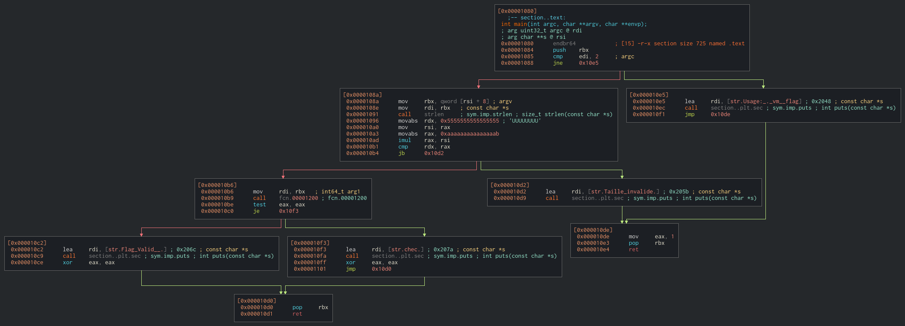
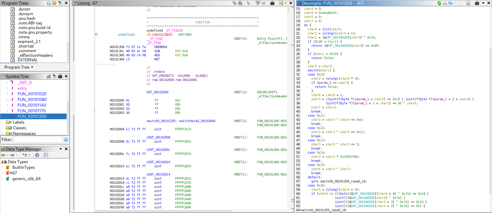
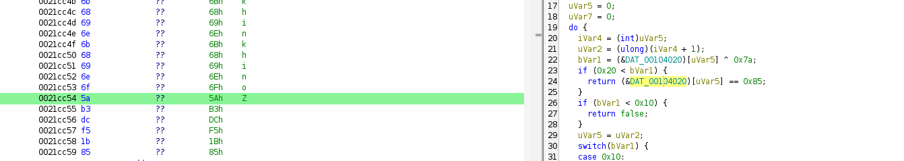
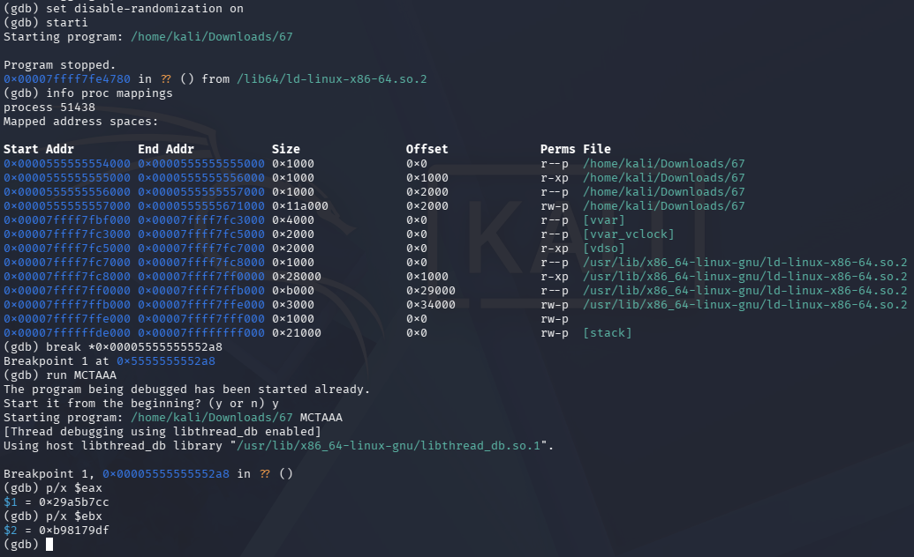

# Midnight Flag 2026 - Reverse - 67

- **Catégorie :** Reverse

- **Fichier fourni :** [`67`](67.txt) (ELF 64-bit stripped)

- **Résumé de la chaîne d'attaque :** Analyse statique (Ghidra) → Reverse d'un bytecode → Brute-force (non résolu)

## Reconnaissance

**Comportement observé :**
- `./67 1111` : "Taille invalide."
- `./67 111111` (6 caractères) : "Échec."

Le programme n'accepte que des entrées dont la taille est un multiple de 3. Cela suggère que les caractères sont traités par blocs de 3 (24 bits).

**Fichier :** Le binaire est un ELF 64-bit dépouillé stripped — l'absence de symboles oblige à chercher la fonction principale manuellement.

## Analyse Statique

On ouvre le binaire dans **Cutter** pour analyser la fonction `main`.



La comparaison principale se trouve dans `fcn.00001200`, trop complexe à analyser directement en assembleur.


On décompile la fonction dans **Ghidra** :



```c

bool FUN_00101200(long param_1,ulong param_2)

{
  byte bVar1;
  ulong uVar2;
  uint uVar3;
  int iVar4;
  uint uVar6;
  uint uVar7;
  int iVar8;
  ulong uVar5;
  
  uVar3 = 0;
  iVar8 = 0;
  uVar6 = 0xdeadbeef;
  uVar5 = 0;
  uVar7 = 0;
  do {
    iVar4 = (int)uVar5;
    uVar2 = (ulong)(iVar4 + 1);
    bVar1 = (&DAT_00104020)[uVar5] ^ 0x7a;
    if (0x20 < bVar1) {
      return (&DAT_00104020)[uVar5] == 0x85;
    }
    if (bVar1 < 0x10) {
      return false;
    }
    uVar5 = uVar2;
    switch(bVar1) {
    case 0x10:
      uVar2 = (ulong)(iVar8 * 3);
      if (param_2 <= uVar2) {
        return false;
      }
      iVar8 = iVar8 + 1;
      uVar3 = ((uint)*(byte *)(param_1 + uVar2) << 0x10 | (uint)*(byte *)(param_1 + 2 + uVar2) |
              (uint)*(byte *)(param_1 + 1 + uVar2) << 8) ^ uVar6;
      uVar7 = uVar3;
      break;
    case 0x11:
      uVar3 = uVar3 ^ uVar3 << 0xd;
      break;
    case 0x12:
      uVar3 = uVar3 ^ uVar3 >> 0x11;
      break;
    case 0x13:
      uVar3 = uVar3 ^ uVar3 << 5;
      break;
    case 0x14:
      uVar3 = uVar3 * 0x2545f491;
      break;
    case 0x15:
      uVar6 = uVar3 ^ uVar7;
      break;
    default:
      goto switchD_00101255_caseD_16;
    case 0x20:
      uVar5 = (ulong)(iVar4 + 5);
      if (uVar6 != (((byte)(&DAT_00104020)[iVar4 + 4] ^ 0x7a) << 0x18 |
                   (uint)((&DAT_00104020)[uVar2] ^ 0x7a) |
                   (uint)((&DAT_00104020)[iVar4 + 3] ^ 0x7a) << 0x10 |
                   (uint)((&DAT_00104020)[iVar4 + 2] ^ 0x7a) << 8)) {
switchD_00101255_caseD_16:
        return false;
      }
    }
  } while( true );
}

```

### Reverse Engineering de la fonction FUN_00101200

L'analyse nous montre une boucle `do...while` qui parcourt un tableau de données (`DAT_00104020`) XORées avec `0x7a`. Ce tableau contient les "instructions" que l'algorithme doit suivre.

| **Case (Hex)** | **Action** | **Détails Techniques** |
| --- | --- | --- |
| **0x10** | **Chargement** | Transforme 3 caractères en un entier de 32 bits (Big Endian) et XOR avec `uVar6` (initialisé à `0xdeadbeef`). |
| **0x11** | **Mélange L** | `uVar3 ^= uVar3 << 13` (Opération classique des générateurs de nombres aléatoires). |
| **0x12** | **Mélange R** | `uVar3 ^= uVar3 >> 17` |
| **0x13** | **Mélange L5** | `uVar3 ^= uVar3 << 5` |
| **0x14** | **Diffusion** | Multiplication par la constante `0x2545f491`. Cela assure que chaque bit de l'entrée influence tout le résultat. |
| **0x15** | **Feedback** | Met à jour l'état interne (`uVar6`) pour le bloc suivant. |
| **0x20** | **Validation** | Compare le résultat final avec une valeur stockée dans `DAT_00104020`. |

### Analyse de la logique de contrôle

L'instruction `(&DAT_00104020)[uVar5] ^ 0x7a` sert de **BC (Bytecode)**. Le programme ne contient pas le flag en clair, mais une "recette" pour transformer ton entrée. Si tu ne donnes pas la bonne lettre, le résultat de la multiplication et des décalages ne correspondra jamais au "Cadenas" (Case `0x20`).

On regarde en mémoire les instructions qui suivent `5a`



```python
               0010402c 6e              ??         6Eh    n
        0010402d 6b              ??         6Bh    k
        0010402e 68              ??         68h    h
        0010402f 69              ??         69h    i
        00104030 6e              ??         6Eh    n
        00104031 6b              ??         6Bh    k
        00104032 68              ??         68h    h
        00104033 69              ??         69h    i
        00104034 6e              ??         6Eh    n
        00104035 6b              ??         6Bh    k
..............
       
        0021cc4f 6b              ??         6Bh    k
        0021cc50 68              ??         68h    h
        0021cc51 69              ??         69h    i
        0021cc52 6e              ??         6Eh    n
        0021cc53 6f              ??         6Fh    o
        0021cc54 5a              ??         5Ah    Z
        0021cc55 b3              ??         B3h
        0021cc56 dc              ??         DCh
        0021cc57 f5              ??         F5h
        0021cc58 1b              ??         1Bh
        0021cc59 85              ??         85h
(FIN)
```

*On voit un paterne qui se repete sauf a la fin*

## Exploitation

### Tentative d'exploitation avec GDB
Le brute-force pur sur les 3 caractères par bloc est trop coûteux sans connaître la valeur cible exacte. On utilise GDB pour lire directement les valeurs comparées au moment de l'exécution.



On place un breakpoint sur l'instruction de comparaison finale `cmp %eax,%ebx` :

```bash
gdb ./67
set disable-randomization on
break *0x00005555555552a8
run MCTAAA
p/x $eax   # résultat de notre calcul 0x29a5b7cc
p/x $ebx   # valeur cible attendue change
```

On observe que **la valeur cible `$ebx` change à chaque bloc** — elle n'est pas fixe mais calculée dynamiquement depuis le bytecode.

### Tentative de Brute-Force

On tente de simuler l'algorithme en Python et de brute-forcer bloc par bloc :

```python
def simulate_block(chars, uVar6):
    # Case 0x10 : On transforme les 3 caractères en un entier 32-bit
    uVar3 = (chars[0] << 16 | chars[1] << 8 | chars[2]) ^ uVar6
    # Case 0x11 : uVar3 ^= uVar3 << 13
    uVar3 = (uVar3 ^ (uVar3 << 13)) & 0xFFFFFFFF
    # Case 0x12 : uVar3 ^= uVar3 >> 17
    uVar3 = (uVar3 ^ (uVar3 >> 17)) & 0xFFFFFFFF
    # Case 0x13 : uVar3 ^= uVar3 << 5
    uVar3 = (uVar3 ^ (uVar3 << 5)) & 0xFFFFFFFF
    # Case 0x14 : Multiplication par la constante magique
    uVar3 = (uVar3 * 0x2545f491) & 0xFFFFFFFF
    
    return uVar3

target_1 = 0x0e54ad40
uVar6_init = 0xdeadbeef

def crack():
    # Alphabet probable pour un début de flag
    alphabet = "MCTF{abcdefghijklmnopqrstuvwxyzABCDEFGHIJKLMNOPQRSTUVWXYZ0123456789}_"
    
    print(f"[*] Brute-forcing bloc 1 (Cible: {hex(target_1)})...")
    
    for c1 in alphabet:
        for c2 in alphabet:
            for c3 in alphabet:
                test_str = [ord(c1), ord(c2), ord(c3)]
                if simulate_block(test_str, uVar6_init) == target_1:
                    print(f"BLOC TROUVÉ : {c1}{c2}{c3}")
                    return
    print("Aucun résultat trouvé")

crack()
```

Le simulateur Python ne se synchronise pas avec les valeurs observées dynamiquement sur GDB. Pour l'entrée `MCT`, le script calcule `0xe4491810` alors que le registre `$eax` dans GDB affiche `0x29a5b7cc`.
