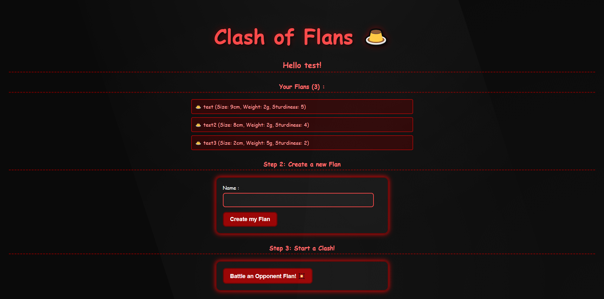
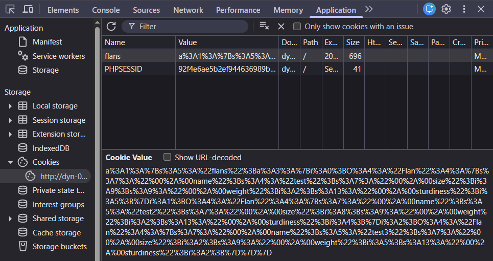

# Midnight Flag 2026 - Web - Clash Of Flans

- **Catégorie :** Web

- **Description :** A new app featuring mysterious underground fights has emerged. Try to uncover the secrets it hides.

- **Fichier fourni :** [`ClashOfFlans.zip`](ClashOfFlans.zip)

- **Résumé de la chaîne d'attaque :** Type juggling sur le cookie `flans[]` → désérialisation PHP → lecture de fichier via `/proc/self/task/18/root/`

## Reconnaissance

- **Découverte du site :** L'application propose des "combats de flans" où les utilisateurs peuvent saisir un nom de boulanger puis constituer leur équipe. Au début d'un combat, l'un des flans du joueur est sélectionné aléatoirement pour affronter un adversaire.


L'analyse de l'archive `ClashOfFlans.zip` fournie nous permet de voir la structure de l'application web :

```text
.
├── ClashOfFlans.zip
├── docker-compose.yml
├── Dockerfile
├── flag.txt
└── src/
    ├── Baker.php
    ├── Clash.php
    ├── Flan.php
    ├── functions.php
    ├── index.php
    ├── main.css
    └── main.js
```

En parcourant le code source, on repere un comportement suspect dans `Clash.php` : On utilise un paramètre utilisateur comme propriété d'objet

```php
public function getSummary()
{
    $side = getParam("side");
    $side = $side ? $this->flan1->$side : "red";  
    ...
}
```

## Analyse des Vulnérabilités

1. **Path Traversal dans la fonction `getClashSummaryByUuid()` du fichier `Baker.php`**

Le code tente de lire un fichier `.cof` en se basant sur un identifiant (`uuid`) fourni par l'utilisateur

> *Un fichier .cof (Clash Of Flans) est un format inventé pour ce challenge, utilisé pour stocker les résultats des combats sur le serveur dans le dossier records/. C'est simplement un fichier texte contenant le résumé d'un combat, nommé avec un UUID aléatoire comme b0435dcd.cof.*

```php
$file = joinpath($CLASH_DIR . '/' . $uuid . '.cof');
$file = substr($file, 0, 100); // Should be enough
if (file_exists($file)) {
    return file_get_contents($file);
}
```

> *Path Traversal : Les fichiers sur un serveur sont organisés en dossiers, comme records/combat123.cof. Si le serveur utilise un nom fourni par l'utilisateur pour construire le chemin d'un fichier sans vérifier, on peut écrire ../flag.txt pour "remonter" d'un dossier et lire un fichier qu'on n'est pas censé voir. [Attack Path Traversal](https://owasp.org/www-community/attacks/Path_Traversal)*

2. **Désérialisation non sécurisée (dans la fonction `load()` du fichier `Baker.php`)**

```php
$data = unserialize(getCookie("flans"));
```

> *La sérialisation transforme un objet PHP en texte pour le stocker (ici dans un cookie). Puisque le cookie est côté client, on peut le modifier. Lors de l'unserialize(), PHP reconstruit l'objet. Si on injecte un objet malveillant, on peut déclencher des comportements imprévus ou manipuler les propriétés de l'application. [Serialisation php vulnerability](https://portswigger.net/web-security/deserialization/exploiting)*

## Exploitation

### 1. Tentative d'accès direct aux propriétés

L'analyse de la variable `$side` montre qu'elle est utilisée pour accéder dynamiquement à une propriété de l'objet `$this->flan1`. 

En testant des paramètres comme `?side=name` ou `?side=size`, le serveur retourne des erreurs fatales : `Fatal error: Uncaught Error: Cannot access protected property Flan::$name`

Bien que des méthodes publiques (getters) existent dans la classe `Flan` (ex: `getName()`), la syntaxe utilisée dans le code est `$this->flan1->$side`. 
-  PHP tente d'accéder à la **propriété** et non à la **méthode**.
- Les propriétés de la classe `Flan` étant définies en `protected`, l'accès direct depuis l'URL est bloqué par le moteur PHP.

C'est ce blocage qui force à pivoter vers une attaque plus complexe : la **désérialisation d'objets**.

### 2. Tentative d'accès avec la désérialisation

On a vu que le cookie `flans` est désérialisé sans vérification (`$data = unserialize(getCookie("flans"));`)

On pourrait forger un cookie qui contient un Baker à la place d'un Flan. Ainsi quand `getSummary()` fait `$this->flan1->$side`, ce serait un Baker et son `__get` serait appelé :



Si on regarde ce cookie dans cyber chef CyberChef ([Decodage](https://gchq.github.io/CyberChef/#recipe=URL_Decode(true)PHP_Deserialize(true/disabled)&input=YSUzQTElM0ElN0JzJTNBNSUzQSUyMmZsYW5zJTIyJTNCYSUzQTMlM0ElN0JpJTNBMCUzQk8lM0E0JTNBJTIyRmxhbiUyMiUzQTQlM0ElN0JzJTNBNyUzQSUyMiUwMCUyQSUwMG5hbWUlMjIlM0JzJTNBNCUzQSUyMnRlc3QlMjIlM0JzJTNBNyUzQSUyMiUwMCUyQSUwMHNpemUlMjIlM0JpJTNBOSUzQnMlM0E5JTNBJTIyJTAwJTJBJTAwd2VpZ2h0JTIyJTNCaSUzQTIlM0JzJTNBMTMlM0ElMjIlMDAlMkElMDBzdHVyZGluZXNzJTIyJTNCaSUzQTUlM0IlN0RpJTNBMSUzQk8lM0E0JTNBJTIyRmxhbiUyMiUzQTQlM0ElN0JzJTNBNyUzQSUyMiUwMCUyQSUwMG5hbWUlMjIlM0JzJTNBNSUzQSUyMnRlc3QyJTIyJTNCcyUzQTclM0ElMjIlMDAlMkElMDBzaXplJTIyJTNCaSUzQTglM0JzJTNBOSUzQSUyMiUwMCUyQSUwMHdlaWdodCUyMiUzQmklM0EyJTNCcyUzQTEzJTNBJTIyJTAwJTJBJTAwc3R1cmRpbmVzcyUyMiUzQmklM0E0JTNCJTdEaSUzQTIlM0JPJTNBNCUzQSUyMkZsYW4lMjIlM0E0JTNBJTdCcyUzQTclM0ElMjIlMDAlMkElMDBuYW1lJTIyJTNCcyUzQTUlM0ElMjJ0ZXN0MyUyMiUzQnMlM0E3JTNBJTIyJTAwJTJBJTAwc2l6ZSUyMiUzQmklM0EyJTNCcyUzQTklM0ElMjIlMDAlMkElMDB3ZWlnaHQlMjIlM0JpJTNBNSUzQnMlM0ExMyUzQSUyMiUwMCUyQSUwMHN0dXJkaW5lc3MlMjIlM0JpJTNBMiUzQiU3RCU3RCU3RA&ieol=CRLF&oeol=CRLF)), on obtient :

```php
a:1:{
  s:5:"flans";
  a:3:{
    i:0;
    O:4:"Flan":4:{
      s:7:"*name"; s:4:"test";
      s:7:"*size"; i:9;
      s:9:"*weight"; i:2;
      s:13:"*sturdiness"; i:5;
    }
    ... (test2 et test3)
  }
}
```

### 3. Création du faux cookie

On va forger un cookie qui contient un objet Baker à la place d'un Flan avec un script PHP en local

```php
<?php

class Baker {
    protected $name;
    protected $flans = [];

    public function __construct($name) {
        $this->name = $name;
    }
}

class Flan {
    protected $name;
    protected $size;
    protected $weight;
    protected $sturdiness;

    public function __construct($name) {
        $this->name = $name;
        $this->size = 9;
        $this->weight = 2;
        $this->sturdiness = 5;
    }
}

// On met un Baker à la place d'un Flan
$fakeFlan = new Baker("test");

$data = ['flans' => [$fakeFlan]];
$serialized = serialize($data);
$encoded = urlencode($serialized);

echo "Serialisé : " . $serialized . "\n\n";
echo "URL encoded : " . $encoded . "\n";
```

Il nous donne ce PHP Serialized suivant : `a%3A1%3A%7Bs%3A5%3A%22flan...`, puis on le remplace dans la valeur du cookie de `flans`, lorsqu'on retourne sur le site **No cooking here!** (le site est bloqué)

### 4. Bypass du filtre

Cependant le filtre `is_bad()` bloque les mots `Baker` et `Clash` dans le cookie. 

```php
function is_bad($param)
{
    $blacklist = array(
        'Clash',
        'Baker'
    );

    foreach ($blacklist as $word) {
        if (strpos($param, $word) != false) {
            return true;
        }
    }
    return false;
}
```

Plusieurs tentatives de bypass ont été explorées :

- **Minuscule** : `baker` et `clash` passent `strpos` (sensible à la casse) et `unserialize` PHP est insensible à la casse mais le chargement de la classe `Clash.php` échoue sur Linux (sensible à la casse pour les fichiers)

- **Position 0** : `strpos` retourne `0` pour une position 0, et `0 != false` est `false` en PHP, donc bypass mais `unserialize` échoue car le payload n'est pas du PHP sérialisé valide au début

- **Tableau HTTP** : En PHP 7.4, `strpos()` avec un tableau retourne `null` au lieu d'une erreur, et `null != false` est `false`, donc le filtre ne bloque pas. En envoyant `flans[]=PAYLOAD`, `getCookie()` appelle `flatten()` qui fait `implode(",", $array)` et retourne le payload seul, donc `unserialize()` fonctionne.

> *C'est cette dernière technique combinée avec un payload utilisant des propriétés **publiques** (au lieu de `protected`) qui constitue la solution finale.*

## Solution

[Lien d'un write-up lu après le CTF](https://floczii.fr/write-ups/midnightflag2026/clashofflans/) Deux éléments ont manqué pendant l'exploration :

1. **Les propriétés publiques dans le payload**

On cherchait à reproduire les propriétés `protected` avec les caractères nuls `\x00*\x00`. En réalité, lors de l'`unserialize()`, PHP instancie correctement les classes même si les propriétés sont déclarées publiques dans le payload.

2. **Le contournement de la limite de 100 caractères**

La fonction `getClashSummaryByUuid()` tronque le chemin à 100 caractères avec `substr($file, 0, 100)`. 
Remonter jusqu'à `/flag.txt` avec des `../` depuis `records/` dépassait cette limite.

La solution est d'utiliser `/proc/self/task/18/root/flag.txt` — un chemin plus court 
qui pointe vers la racine du système de fichiers via le processus Apache, 
permettant d'atteindre `/flag.txt` sans dépasser 100 caractères.

- Flag : `MCTF{7hr33-ch4rs_pr0bl3m}` !