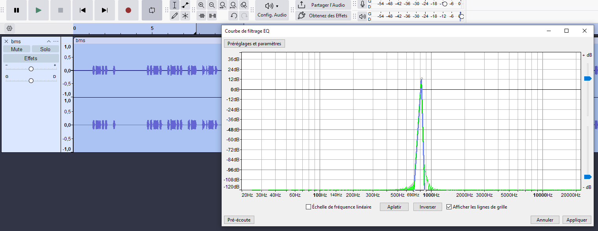

# Jour 3 - OSINT (intrigue principale)

> Opération Bellatrix – Jour 3
    recherche OSINT et Localisation de la Pilote "Lynx"
    25 mars 2026

Bienvenue dans le Jour 3

Hier, vous avez réussi à attribuer techniquement la campagne de désinformation à la milice adverse. Aujourd’hui, votre mission est cruciale : localiser le lieu de détention de la pilote "Lynx" en utilisant des techniques avancées de recherche en sources ouvertes (OSINT).

Objectif du Jour 3

- Identifier des indices géolocalisés (photos, vidéos, réseaux sociaux, données publiques) liés à la détention de Lynx.
- Croiser les informations pour déterminer une zone précise (ville, bâtiment, coordonnées GPS).
- Valider vos hypothèses avec des preuves tangibles (métadonnées, témoignages, images satellites).

Attention, certains flag sont relatifs à l'intrigue et sont spécifiés (intrigue principale) et d'autres sont optionnels et mentionnés (optionnel)

---

Méthodologie Recommandée

1. Analyse des Médias Sociaux :
- Recherchez des publications récentes (Twitter, Telegram, forums) mentionnant "Lynx", "pilote française", ou des hashtags liés à l’opération.
- Utilisez des outils comme Maltego, TinEye ou Google Reverse Image Search pour retracer l’origine des images.

2. Exploitation des Données Publiques :
- Consultez les registres immobiliers, cartes satellites (Google Earth, Sentinel Hub), ou bases de données locales pour identifier des bâtiments suspects.
- Vérifiez les archives de presse locale pour des mentions de mouvements inhabituels (convois militaires, rassemblements).

3. Analyse des Métadonnées :
- Extrayez les données EXIF des photos ou vidéos liées à la détention (coordonnées GPS, - modèle d’appareil, date/heure).
Utilisez ExifTool ou Foca pour automatiser cette extraction.

4. Corrélation avec des Sources Humaines :
- Identifiez des témoignages ou fuites sur des forums spécialisés (ex : Reddit, 4chan) ou via des comptes anonymes.
- Croisez ces informations avec des données techniques pour confirmer leur crédibilité.

--- 
Exemple de Flag pour le Jour 3

Épreuve : Localisation de Lynx
Trouvez les coordonnées GPS ou l’adresse précise du lieu de détention de la pilote "Lynx".
Format du flag : BELLATRIX{latitude_longitude} ou BELLATRIX{adresse_complete}

Le flag pour ce premier challenge vous octroie 100 points, il s'agit du mot de passe utilisé par Marc Veylanne pour se connecter à l'interface des bons de réduction.

BELLATRIX{VLAN2024}

--- 

Objectif Final

À la fin de la journée, vous devrez soumettre :

- Les coordonnées GPS ou l’adresse du lieu de détention.
- Les preuves OSINT ayant permis cette identification (images, métadonnées, témoignages).
- Une carte ou un schéma illustrant la localisation (facultatif mais apprécié).

Message aux Agents : *"Lynx compte sur vous. Chaque indice rapproche les forces françaises de sa libération. Soyez rigoureux, créatifs, et méthodiques. La mission dépend de votre capacité à transformer des données éparses en une localisation précise."*

À vos outils, agents ! La course contre la montre est lancée.

## Flag

```
BELLATRIX{VLAN2024}
```

https://peche-fraiche.boutique/sauvegardes_reduc.php

Identifiant : `mveylanne:VLAN2024`
```
Liste des bons de réduction utilisés
Bon de réduction: OPE-GRIFFON - Date/Heure: 2023-03-20 14:30
Bon de réduction: OPE-TAMBOUILLE - Date/Heure: 2025-03-22 09:15
Bon de réduction: OPE-BRISER-LES-AILES - Date/Heure: 2026-03-24 06:3
```


# En chemin pour une partie de pêche (optionnel)

Mission: Vous êtes chargé de retracer l’itinéraire de Marc Veylanne en analysant ses haltes géolocalisées lors de ses déplacements vers son lieu de pêche. Votre objectif est de localiser sa zone d’origine en vous basant sur les traces qu’il a laissées. Le flag sera la distance entre ses deux avis les plus éloignés, ce qui permettra de circonscrire son territoire de départ.

Pour effectuer cette recherche un service ami vous communique le profil Google de Marc Veylanne: https://www.google.com/maps/contrib/107774103484141078088/

Actions requises: Collecter les données géolocalisées (avis, commentaires, publications) laissées par Marc Veylanne. Cartographier les haltes sur une carte pour visualiser son itinéraire. Déterminer la zone d’origine en analysant la répartition des points et calculer la distance maximale entre ces points. Calculer la distances entre les points pour identifier les deux avis les plus éloignés.

## Resolution

On trouve 4 avis

- Port d'Arcachon Quai Goslar, 33120 Arcachon
    
    `44.66234646701785, -1.151063189842853`
- Port de la Mole, 29 Av. Eric Tabarly, 33470 Gujan-Mestras

    `44.64362376060957, -1.0525274593335647`
- Parcours sportif, 51 Av. de Gascogne, 33114 Le Barp
    
    `44.6029085517786, -0.7608166506295522`
- Domaine Départemental Gérard Lagors, 33125 Hostens
    
    `44.498071118636, -0.6520362118976225`

La plus grande distance est entre le Port d'Arcachon et le Domaine Gérard Lagors,  La distance à vol d'oiseau est 43,54 km

## Flag 

```
BELLATRIX{43,54}
```

# Remonter la piste (optionnel)

Mission : Vous devez déterminer l’azimut (angle de direction par rapport au nord géographique) pour remonter la piste spécifique, liée au trajet ou au déplacement mentionné précédemment (ex. : itinéraire de Marc Veylanne, sentier de pêche, etc.). Cet azimut servira à retracer avec précision la trajectoire empruntée et à localiser des points clés.

Pour effectuer cette recherche un service ami vous communique le profil Google de Marc Veylanne: https://www.google.com/maps/contrib/107774103484141078088/

Actions requises :

Identifier les points de départ et d’arrivée de la piste : Coordonnées GPS exactes (latitude/longitude) ou adresses précises. Si non disponibles, utiliser des indices géographiques (ex. : "à 5 km au nord-est"). Calculer l’azimut entre ces points : Utiliser la formule de l’azimut (basée sur les coordonnées GPS) pour obtenir l’azimut en degrés à deux décimales.

## Resolution

"Remonter la piste" = trouver l'azimut du trajet de Marc, c'est-à-dire la direction qu'il emprunte depuis sa zone d'origine vers son lieu de pêche. Arcachon → Lagors = 114,63°


## Flag
```
BELLATRIX{114,63}
```

# On se rapproche (optionnel)

Mission : Sur le site Rando-Gogo, un célèbre site de randonnées Aquiloniennes accessible sur https://rando-gogo.site/, votre objectif est de trouver le point d'intérêt mentionné et par recherche OSINT le code du point d’intérêt mentionné (probablement un lieu, un sentier, ou une balise spécifique). Ce "PlusCode" pourrait être un identifiant unique correspondant a ce lieu unique, un numéro de référence, ou un tag utilisé pour localiser ou gérer ce point d’intérêt dans la base de données du site.

Actions requises : Localiser le point d’intérêt sur Rando-Gogo Rechercher le nom du point d’intérêt dans la barre de recherche du site. Explorer les cartes interactives ou les listes de sentiers/balises pour le repérer.

Attention: ce flag contient en plus des caratères autorisés un caractère "+"

## Resolution

sur le site il y a 3 randonnees

- La Boucle du pêcheur
- La Randonnée des Crêtes de l’Aquilon
- Le Sentier des Forêts Enchantées par Marc Veylanne

On va donc analyser la page de se dernier :

```
Proposée par Marc Veylanne, cette randonnée vous plonge dans l’atmosphère mystique des forêts aquiloniennes.

Description
Un parcours de 8 km à travers des forêts anciennes, où la lumière filtre à travers les cimes des arbres centenaires. Marc Veylanne, expert en randonnée et auteur renommé, a spécialement conçu ce sentier pour offrir une expérience immersive dans la nature.

Points d’intérêt
L’Arbre Millénaire : un chêne plusieurs fois centenaire
La Clairière des Fées : un espace ouvert entouré de fleurs sauvages
La Source Mystique : une source d’eau pure réputée pour ses vertus
Trace GPS
Téléchargez la trace GPS de cette randonnée ici.

A propos de Marc Veylanne
Marc Veylanne est un randonneur passionné et auteur de plusieurs guides sur les randonnées en Aquilonie. Ses itinéraires sont réputés pour leur beauté et leur accessibilité.
```

Le mot ici est clickable vers le lien https://rando-aquiloniennes.com/traces/gps_forets_enchantees.gpx mais le lien n existe pas


Puisque le lien de la trace GPS est mort, l'information est stockée dans la base de données du site. Utilise cette URL pour interroger tous les articles ("posts") contenant des données géographiques : https://rando-gogo.site/index.php?rest_route=/wp/v2/posts, et on retrouve les Points d'intérêt mentionnés

- Crêtes de l'Aquilon (10),"Belvédère de l'Aigle, Cascade des Nymphes, Lac Bleu "
- Forêts Enchantées (11),"L'Arbre Millénaire, La Clairière des Fées, La Source Mystique "
- Boucle du pêcheur (12),L'aire de Caussatieu 
    
    L’aire de Caussatieu correspond Aire de Caussarieu (`GJ5F+R5` à Léogeats 33210)


## Flag
```
BELLATRIX{GJ5F+R5_Leogeats}
```

# Les archives au secours (optionnel)

Mission : Vous avez obtenu un titre de propriété intéressant via les archives de la préfecture. Votre objectif est maintenant de retrouver la parcelle cadastrale correspondante pour localiser précisément le terrain, identifier son propriétaire actuel, et analyser son historique (ventes, usages, liens éventuels avec des activités suspectes).

Actions requises : Extraire les informations clés du titre de propriété Numéro de lot/parcelle (ex. : Section AB, Parcelle 123). Adresse ou lieu-dit (ex. : "5 Rue des Pêcheurs, Langon"). Nom du propriétaire (ancien ou actuel). Date d’enregistrement du titre. Consulter le cadastre en ligne Utiliser le site officiel du cadastre français : cadastre.gouv.fr. Identifier la parcelle cadastrale précise par son code.

Vérifier les limites de la parcelle et son environnement (proximité avec d’autres terrains suspects).

## Resolution

Sur le site `https://www.cadastre.gouv.fr/scpc/rechercherParReferenceCadastrale.do`

On cherche le cadastre `000C198`, Département `33`, et Ville `LEOGEATS`, sauf que sur le doccument donné on voit deux titre de propriete et le `000C198` ne donne rien (juste un champs) on essaye alors avec le `000C188` et on tombe sur une petite cabanne :


https://www.cadastre.gouv.fr/scpc/afficherCarteParcelle.do?CSRF_TOKEN=UIKO-FKZG-8EN6-VGY5-O3GG-MGL8-DRVG-I5LD&p=F32370000C0188&f=F32370000C01&dontSaveLastForward&keepVolatileSession=

## Flag
```
000C188
```


# Localisation de "Lynx" (intrigue principale)

Mission: Vous avez maintenant toutes les preuves de l'implication de la milice il faut désormais localiser la pilote pour déclencher l'opération "ouvrir la cage" afin de la libérer. Votre objectif final: localiser précisément la pilote LYNX retenu en otage. Vous disposez de deux photos de la maison de détention.

Actions requises:

Analyser la photo de la maison pour extraire des indices visuels
Valider la localisation avec les indices fournis sur la plateforme
Séparateur _ !

## Resolution

On mets la localisation de la cabanne trouvé grace aux cadastre `000C188`, on confirme que cest la bonne position grace aux images qui sont identiques

## Flag 
```
BELLATRIX{44.509111_-0.372694}
```

# Le plein trop cher (optionnel)

Mission : Une interception sur une application de messagerie indique que Marc Veylanne signale "avoir effectué un plein de diesel à un prix très élevé le 18 mars 2026 à l'intermarché de Langon". Votre objectif est d’identifier la station-service exacte où il a fait ce plein et de confirmer le prix pratiqué ce jour-là.

Actions requises :

Vérifier les prix du diesel le 18/03/2026 via les plateformes de suivi des prix (comme https://www.prix-carburants.gouv.fr/ ). Nom et adresse de la station. Prix du diesel le 18/03/2026.

## Resolution

sur https://www.prix-carburants.gouv.fr/ on ne peut que voir les prix les plus recent mais dans https://www.prix-carburants.gouv.fr/rubrique/opendata/ on voit que on peut telecharger les données des 30 derniers jours en ajoutant la date au format AAAAMMJJ (année, mois, jour) en fin d'URL. On telecharge donc le fichier a l'adresse suivante `https://donnees.roulez-eco.fr/opendata/jour/20260318`

```bash
grep -a -A 25 "33210" PrixCarburants_quotidien_20260318.xml | grep -a "Gazole" | grep "2026-03-18"
```

```xml
<prix nom="Gazole" id="1" maj="2026-03-18T09:14:14" valeur="2.013"/>
<prix nom="Gazole" id="1" maj="2026-03-18T00:01:00" valeur="2.09"/>
```

## Flag 
```
BELLATRIX{2.013}
```

# Temps incertains (optionnel)

Mission : Votre objectif est de décrypter un message caché dans un bulletin météo spécial, probablement diffusé à une date ou sur un canal spécifique (radio, site web, application). Ce message pourrait être dissimulé sous forme de codes, d’anagrammes, de séquences numériques, ou de mots-clés intégrés dans les prévisions.

Actions requises :

Analyser le contenu pour repérer des anomalies :

Mots ou phrases inhabituels (ex. : termes techniques détournés, répétitions).
Séquences numériques (températures, pressions, heures) pouvant cacher un code.
Acrostiches ou anagrammes dans les descriptions.
Symboles ou icônes suspectes (ex. : pictogrammes modifiés).
Identifier le message caché

[bms.wav](resources/bms.wav)

## Resolution 

Comme le code morse est melangé avec une diffusion meteo qui resonne il est difficile de distingue les bips. Dans audacity on modifie la piste audio pour isoler les frequence autour de 800 Hz et on passe un noise gate pour enlever le bruit. [bms-FILTRE.wav](resources/bms-FILTRE.wav)



On arrive à trouvé difficilement a trouvé `LE FLUG EST BELLATRIX LYNX R...CUP...R...` on en deduis que le message est `BELLATRIX LYNX RÉCUPÉRÉ`

## Flag 

```
BELLATRIX{lynx_récupérée}
```