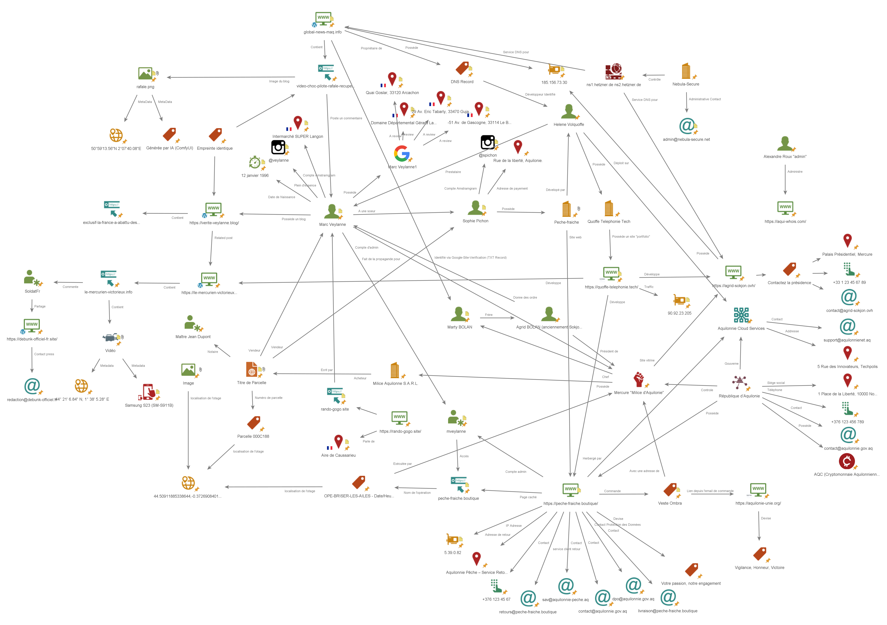

# Bellatrix CTF 2026

This repository hosts my write-ups and solutions for the Bellatrix CTF 2026, organized by the French Ministry of Armed Forces (COMCYBER).

## 🏆 Performance & Ranking

* **Ranking:** 207th / 1006 participants (**Top 20%**)
* **Certificate:** [Participation Certificate](Assets/diplome-finisher-id.pdf)

## 📅 Event Details
* **Date:** March 23 - 27, 2026
* **Official Website:** [defense.gouv/bellatrix](https://www.defense.gouv.fr/comcyber/actualites/orion-26-lancement-loperation-bellatrix-destination-jeunesse)

## 📑 Analysis & Solutions

The event was structured into three distinct daily phases, each focusing on a specific topic of cybersecurity:

Day 1: Analysis, Day 2: Technical – Exploitation, Day 3: OSINT

| Challenge | Category | Write-up |
| :--- | :--- | :--- |
|Day 3 | OSINT / Investigation | [📄 View Analysis](Phase3_OSINT/README.md) |

I used Maltego to map out the connections between different entities found during this challenge : [Bellatrix2026.mtgl](Maltego/Bellatrix2026.mtgl)

